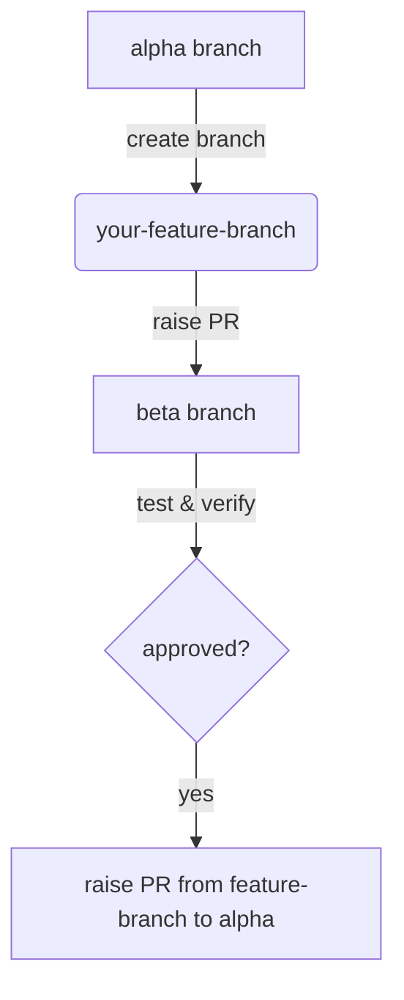

# Git Guidelines & Release Workflow

This document outlines the repository branching standards, commit messages, development workflows, and release protocols.

---

## 🌿 1. Branching & Commit Conventions

### A. Branch Naming
All branches must follow this structure:
```text
[name]/[project]/[platform]/[type]/[id]-[description]
```
* **Example:** `creator/ria/web/feat/104-mobile-navbar`
* **Values:** `yami` | `ria` | `web` (frontend) / `api` (backend) | `feat` / `fix` / `refact` / `docs`

### B. Commit Messages
Commit messages must follow the Conventional Commits specification:
```text
<type>(<platform>): <description> [RIA-<id>]
```
* **Example:** `feat(web): add mobile menu [RIA-104]`

---

## 🛠️ 2. Core Git Operations

### A. Setup & Initialization
```bash
# Initialize a new repository
git init

# Configure identity
git config user.name "Your Name"
git config user.email "your.email@example.com"
```

### B. Stage, Commit, and Push
```bash
# Check modified files
git status

# Stage files
git add .

# Create a commit
git commit -m "feat(web): add contact page [RIA-106]"

# Push branch to GitHub
git push origin <branch-name>
```

---

## 🔄 3. Alpha & Beta Release Workflow

To keep production code safe, we use a two-branch release environment:
* **`alpha`** — The production branch. Direct commits are strictly forbidden.
* **`beta`** — The testing/staging branch.



### Step 1: Create a Feature Branch
Create your development branch off the production `alpha` branch:
```bash
git checkout alpha
git pull origin alpha
git checkout -b creator/ria/web/feat/106-contact-page
```

### Step 2: Push & Raise PR to Beta (Testing)
Push your commits and open a Pull Request targeting the `beta` branch:
```bash
git push origin creator/ria/web/feat/106-contact-page
```
*Raise a PR on GitHub comparing your branch to `beta`.*

### Step 3: Test in Beta
Once the PR is merged into `beta`, test and verify all functionality.

### Step 4: Raise PR to Alpha (Production)
Once verified in `beta`, open a final Pull Request comparing your original branch to **`alpha`** to deploy your changes to production.

---

## ⚠️ 4. Golden Rules & Syncing

### A. Always Pull Before Merging/Pushing
To avoid merge conflicts, pull the latest changes from the target branch before merging:
```bash
git checkout alpha
git pull origin alpha
```

### B. Forbidden Commits & Commands
* ❌ **Never direct commit to `main`, `alpha`, or `beta` branches.**
* ❌ **Never force push (`git push -f`) on shared branches (`main`, `alpha`, `beta`).**
* ❌ **Never delete remote production branches.**
* ❌ **Never rebase commits that have already been pushed to a shared remote.**
